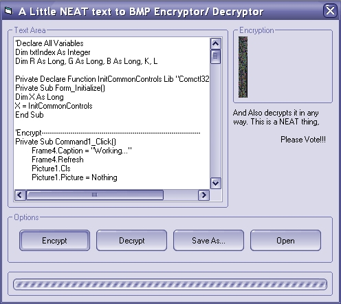



## Save Text into bitmap, and read it any time\!\!\!

### Description

This neat thing saves text into a bitmap. it puts 3 letters in every pixel of a bitmap, and saves bitmaps. when you want to make a program with a perminant password this thing is really neat!!!
 
### More Info
 

             |
---                |---
**Submitted On**   |2002-10-30 06:39:44
**By**             |[Leo Barsukov](https://github.com/Planet-Source-Code/PSCIndex/blob/master/ByAuthor/leo-barsukov.md)
**Level**          |Advanced
**User Rating**    |4.7 (14 globes from 3 users)
**Compatibility**  |VB 6\.0
**Category**       |[Graphics](https://github.com/Planet-Source-Code/PSCIndex/blob/master/ByCategory/graphics__1-46.md)
**World**          |[Visual Basic](https://github.com/Planet-Source-Code/PSCIndex/blob/master/ByWorld/visual-basic.md)
**Archive File**   |[Save\_Text\_14891810302002\.zip](https://github.com/Planet-Source-Code/leo-barsukov-save-text-into-bitmap-and-read-it-any-time__1-40266/archive/master.zip)

